  <picture>
    <source media="(prefers-color-scheme: dark)" srcset="assets/header-dark.svg">
    <source media="(prefers-color-scheme: light)" srcset="assets/header-light.svg">
    
  </picture>

  

### &nbsp; About

I'm a Direct PhD student in Computer Science at **KFUPM**, Saudi Arabia. I build and audit language models, with a focus on **Arabic NLP**, **LLM evaluation** and **AI security**.

### &nbsp; Current research

**The Dialect Token Tax**&nbsp; <code>Deep&nbsp;Learning&nbsp;·&nbsp;2026</code> 
How LLM tokenizers fragment Arabic dialects compared with MSA, and a dialect-aware vocabulary extension using LoRA/QLoRA.

**Judging the Judges**&nbsp; <code>NLP&nbsp;·&nbsp;2026</code> 
Auditing how reliably LLM judges score software-requirement refinements.

**Overtuning Under a Low-Fidelity Indicator**&nbsp; <code>Metaheuristics&nbsp;·&nbsp;2026</code> 
A budget-matched audit of GA, DE, PSO and SA for CNN architecture search on NAS-Bench-201.

### &nbsp; Experience & education

**Teaching Assistant, KFUPM**&nbsp; <code>since&nbsp;2026</code> 
Java object-oriented programming labs (ICS 108).

**B.Sc. in Computer Science, KFUPM**&nbsp; <code>2024</code> 
First Class Honors. Capstone: SkyBeam, a UAV-mounted laser sensor for methane leak detection, with Raspberry Pi processing and LoRa telemetry.

**AI Intern, KAUST Academy**&nbsp; <code>2023</code> 
Arabic chatbot prototype for Absher; fine-tuned XLM-RoBERTa to 96% accuracy, with Whisper and ElevenLabs voice I/O.

### &nbsp; Toolkit

  <picture><source media="(prefers-color-scheme: dark)" srcset="assets/chip-python-dark.svg"></picture>
  <picture><source media="(prefers-color-scheme: dark)" srcset="assets/chip-pytorch-dark.svg"></picture>
  <picture><source media="(prefers-color-scheme: dark)" srcset="assets/chip-hugging-face-transformers-dark.svg"></picture>
  <picture><source media="(prefers-color-scheme: dark)" srcset="assets/chip-java-dark.svg"></picture>
  <picture><source media="(prefers-color-scheme: dark)" srcset="assets/chip-javascript-dark.svg"></picture>
  <picture><source media="(prefers-color-scheme: dark)" srcset="assets/chip-react-dark.svg"></picture>

